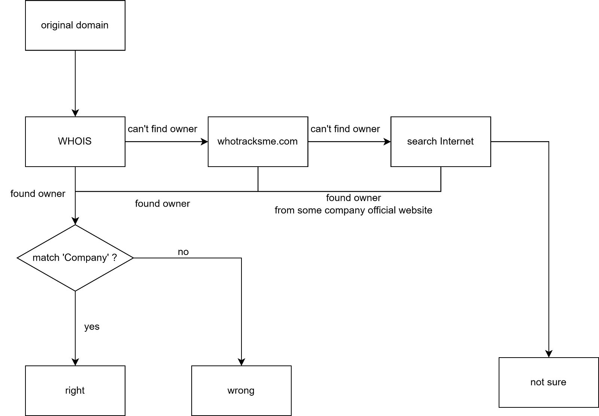
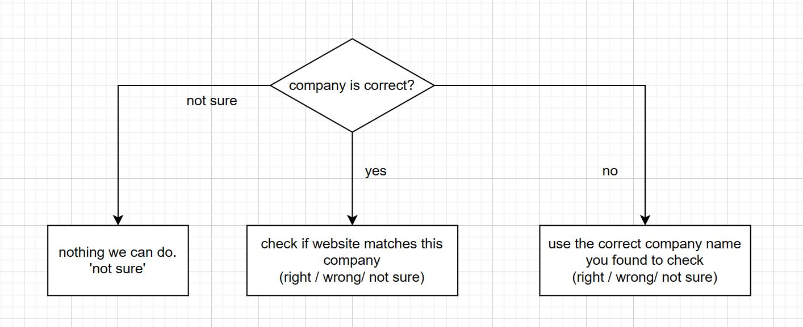

# ECE GY 9393 IoT Security Project
Haoran Wang | Mahati Madhira

## Structure
```
├───code
│   ├───jupyter
│   └───__pycache__
└───data
    ├───CDN
    ├───comparison
    └───full
        ├───haoran
        │   ├───prompt1
        │   ├───prompt2
        │   └───prompt3
        └───mahati
            ├───prompt1
            ├───prompt4
            └───prompt5
```

## GPT Processing
* Split dataset into pieces (200 per iteration)
* Results in JSON format, save to csv files

## Validating
- manually sample and check
- interest points (some interesting URLs)
- CDN fine grind

## Comparing different prompts
1 initial prompt (prompt1) + 4 different of prompts
### Initial prompt (prompt1)
> You are a network expert. Find out the purpose of the provided URL (choose one out of the options: tracking, marketing, advertising, analytics, CDN, static server, DNS, first-party host).  Response in JSON containing following fields: company, company_website, result. Respond in JSON only.
### Haoran
- prompt 2: paraphrased prompt1
> You are a network expert identifying URLs. Determine the purpose of the URL and provide the following information in a JSON format: company: the name of the company that owns the URL; company_website: the website of the company; ressult: the purpose of the domain (choose one out of the options: tracking, marketing, advertising, analytics, CDN, static server, DNS, first-party host).
- prompt 3: same as prompt1 but with different temperature = 1
### Mahati
- prompt 4
> As a network expert, you are tasked with analyzing URLs visited by IoT devices. Your goal is to determine the purpose of each URL and provide the following information in JSON format: company name, company website, and the purpose of the domain. Please choose one of the following purposes for each domain: tracking, marketing, advertising, analytics, CDN, static server, DNS, or first-party host. The JSON format should include the following keys: "company", "company_website", and "result".
- prompt 5
> You have been hired to analyze the web traffic of IoT devices in order to determine the purpose of each visited URL. Your task is to provide a JSON report for each URL, which should include the following keys: 'company', 'company_website', and 'result'. The 'company' key should contain the name of the company responsible for the URL, and the 'company_website' key should contain the website of that company. The 'result' key should specify the purpose of the domain, which could be one of the following: tracking, marketing, advertising, analytics, CDN, static server, DNS, or first-party host.

## Criteria
1. the correctness of company (count right/wrong/not sure)
2. the correctness of company website (count right/wrong/not sure)
3. the correctness of result (count right/wrong/not sure)
4. similarity between 2 prompts (how many similar; how many drastic differences on company, company website, result)

## Workflows of validation
### Company Validation

### Company Website Validation

### Identification Result Validation
Based on the company websites we have from previous steps, manually check the major business of the company and make judgement. This validation is more subjective.

tp-link.com
tplinkcloud.com
use1-api.tplinkra.com


marketing == ad
1.5 most different than others
